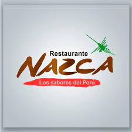

<html lang="en">
<head>
    <meta charset="UTF-8">
    <meta name="viewport" content="width=device-width, initial-scale=1.0">
    <title>Peruvian Restaurant Sabor Inca</title>
    <link rel="stylesheet" href="styles.css">
</head>
<body>
    <header>
        <h1>Peruvian Restaurant Sabor Inca</h1>
        <nav>
            <ul>
                <li><a href="#home">Home</a></li>
                <li><a href="#menu">Menu</a></li>
                <li><a href="#location">Location</a></li>
                <li><a href="#contact">Contact</a></li>
            </ul>
        </nav>
    </header>

    <section id="home">
        <h2>Welcome to Sabor Inca</h2>
        
Discover the authentic flavors of Peru at our restaurant. We offer a unique culinary experience with the most representative dishes of Peruvian cuisine.

        
    </section>

    <section id="menu">
        <h2>Our Menu</h2>
        <ul>
            <li><strong>Ceviche</strong> - Fish marinated in lime juice with onions and chili peppers.</li>
            <li><strong>Lomo Saltado</strong> - Stir-fried beef with onions, tomatoes, and fries.</li>
            <li><strong>Aji de Gallina</strong> - Shredded chicken in a yellow chili pepper sauce.</li>
            <li><strong>Anticuchos</strong> - Grilled beef heart skewers.</li>
            <li><strong>Pisco Sour</strong> - Traditional Peruvian cocktail made with pisco.</li>
        </ul>
    </section>

    <section id="location">
        <h2>Location</h2>
        
We are located in the heart of the city, at Flavors Street, number 123.

        <iframe src="https://www.google.com/maps/embed?pb=!1m18!1m12!1m3!1d3164.1461481675875!2d-122.08424968421597!3d37.42199977982562!2m3!1f0!2f0!3f0!3m2!1i1024!2i768!4f13.1!3m3!1m2!1s0x808fb5e8f4d9bf4f%3A0x8e5a3e2c1b6e2c7!2sGoogleplex!5e0!3m2!1sen!2s!4v1594278008691!5m2!1sen!2s" width="600" height="450" style="border:0;" allowfullscreen="" aria-hidden="false" tabindex="0"></iframe>
    </section>

    <section id="contact">
        <h2>Contact</h2>
        <form action="send.php" method="post">
            <label for="name">Name:</label>
            <input type="text" id="name" name="name" required>
            
            <label for="email">Email:</label>
            <input type="email" id="email" name="email" required>
            
            <label for="message">Message:</label>
            <textarea id="message" name="message" required></textarea>
            
            <button type="submit">Send</button>
        </form>
    </section>

    <footer>
        
&copy; 2024 Peruvian Restaurant Sabor Inca. All rights reserved.

    </footer>
</body>
</html>
