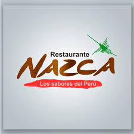

<!DOCTYPE html>
<html lang="es">
<head>
    <meta charset="UTF-8">
    <meta name="viewport" content="width=device-width, initial-scale=1.0">
    <title>Restaurante Peruano Sabor Inca</title>
    <link rel="stylesheet" href="styles.css">
</head>
<body>
    <header>
        <h1>Restaurante Peruano Sabor Inca</h1>
        <nav>
            <ul>
                <li><a href="#inicio">Inicio</a></li>
                <li><a href="#menu">Menú</a></li>
                <li><a href="#ubicacion">Ubicación</a></li>
                <li><a href="#contacto">Contacto</a></li>
            </ul>
        </nav>
    </header>

    <section id="inicio">
        <h2>Bienvenidos a Sabor Inca</h2>
        
Descubre los auténticos sabores del Perú en nuestro restaurante. Ofrecemos una experiencia culinaria única con los platos más representativos de la gastronomía peruana.

        
    </section>

    <section id="menu">
        <h2>Nuestro Menú</h2>
        <ul>
            <li><strong>Ceviche</strong> - Pescado marinado en jugo de limón con cebolla y ají.</li>
            <li><strong>Lomo Saltado</strong> - Carne salteada con cebolla, tomate y papas fritas.</li>
            <li><strong>Aji de Gallina</strong> - Pollo desmenuzado en una salsa de ají amarillo.</li>
            <li><strong>Anticuchos</strong> - Brochetas de corazón de res marinadas y asadas.</li>
            <li><strong>Pisco Sour</strong> - Cóctel tradicional peruano a base de pisco.</li>
        </ul>
    </section>

    <section id="ubicacion">
        <h2>Ubicación</h2>
        
Nos encontramos en el corazón de la ciudad, en la calle de los sabores, número 123.

        <iframe src="https://www.google.com/maps/embed?pb=!1m18!1m12!1m3!1d3164.1461481675875!2d-122.08424968421597!3d37.42199977982562!2m3!1f0!2f0!3f0!3m2!1i1024!2i768!4f13.1!3m3!1m2!1s0x808fb5e8f4d9bf4f%3A0x8e5a3e2c1b6e2c7!2sGoogleplex!5e0!3m2!1ses!2s!4v1594278008691!5m2!1ses!2s" width="600" height="450" style="border:0;" allowfullscreen="" aria-hidden="false" tabindex="0"></iframe>
    </section>

    <section id="contacto">
        <h2>Contacto</h2>
        <form action="enviar.php" method="post">
            <label for="nombre">Nombre:</label>
            <input type="text" id="nombre" name="nombre" required>
            
            <label for="email">Correo Electrónico:</label>
            <input type="email" id="email" name="email" required>
            
            <label for="mensaje">Mensaje:</label>
            <textarea id="mensaje" name="mensaje" required></textarea>
            
            <button type="submit">Enviar</button>
        </form>
    </section>

    <footer>
        
&copy; 2024 Restaurante Peruano Sabor Inca. Todos los derechos reservados.

    </footer>
</body>
</html>
